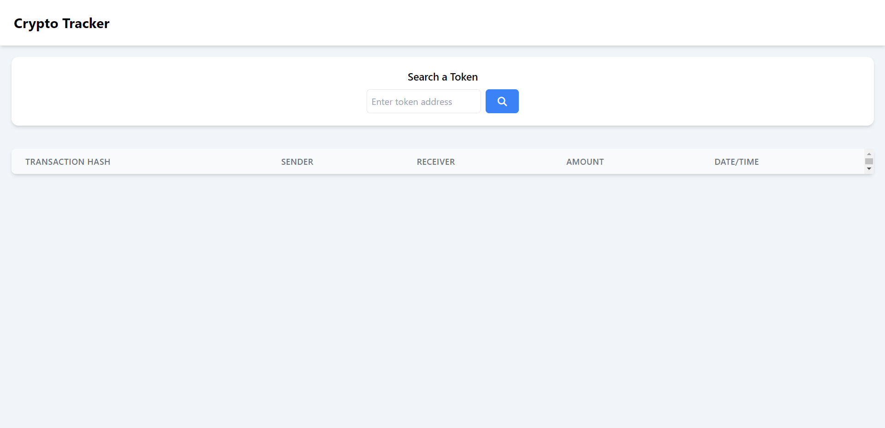
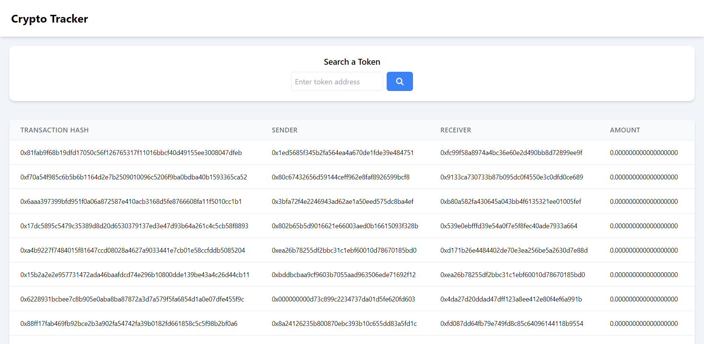
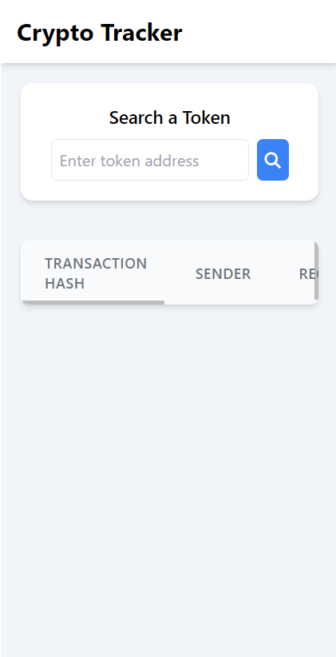
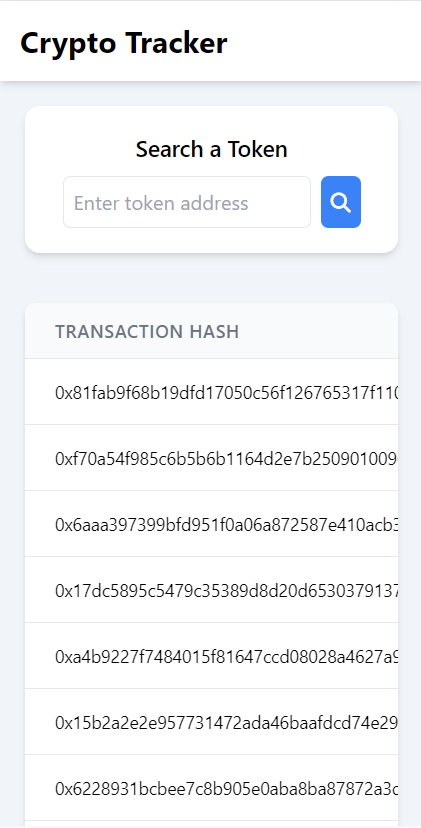
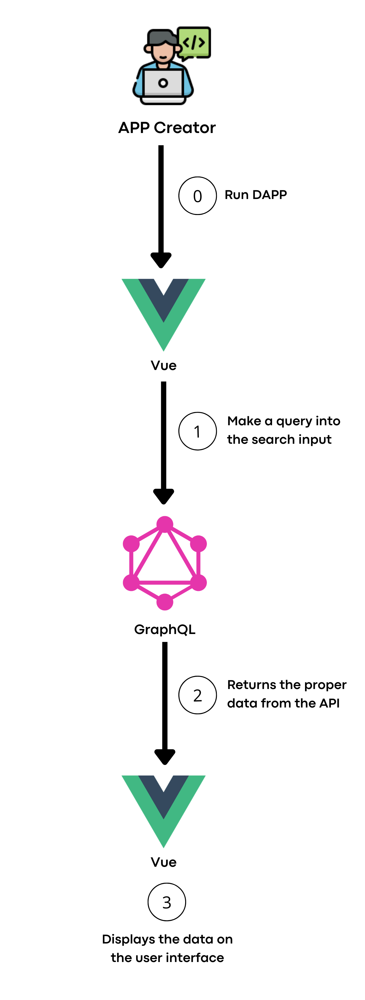

# Crypto Tracker - web 3.0


### About

Welcome to Crypto Tracker, your transaction tracker to tokens on BSC mainnet 🥮

### Index

-   <a href="#layout">Layout</a>
-   <a href="#requirements">Requirements</a>
-   <a href="#workflow">Workflow</a>
-   <a href="#demonstration">Demonstration</a>
-   <a href="#technologies-used">Technologies used</a>

### Layout

<p align="center">
  
</p>

<p align="center">
  
</p>

<p align="center">
  
</p>

<p align="center">
  
</p>

### Requirements

Before getting started, make sure your machine has the following tools: [Git](https://git-scm.com/), and [Node.js](https://nodejs.org/en). It is important to have a code editor too, such as [VSCode](https://code.visualstudio.com/).

```bash
# Clone this repository
$ git clone https://github.com/eduvarjaor/crypto-tracker.git

# Access project folder
$ cd crypto-tracker

# Install dependencies
$ yarn install

# Set the environment variables as in .env.example file

# Execute the project in development mode
$ yarn dev

# The server will open on port:3000 - access http://localhost:3000/
```

### Workflow



### Demonstration

[Usage video](https://youtu.be/Xxz030jFIwE)

### Technologies used

The project uses these tools:

1. [Vue.js](https://legacy.reactjs.org/)
2. [Typescript](https://www.typescriptlang.org/docs/)
3. [TailwindCSS](https://tailwindcss.com/)
4. [Node.js](https://nodejs.org/en)
5. [Nuxt.js](https://nuxt.com/docs/getting-started/introduction)
6. [GraphQL](https://graphql.org/learn/)

---

Made with 💙 by eduvarjaor 👋 [See my LinkedIn](https://www.linkedin.com/in/eduvarjaor/?locale=en_US)
